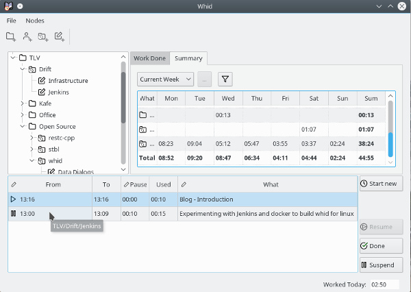

# Whid

**What Have I Done** - Time Tracker for Freelancers and Individual Contractors

 Screenshot from Debian Linux

## Backstory

This project started in 1998, when I felt that I totally lost control with my time.
I wrote a Windows application to help me, and used it for many years. In 2006, I
read a great book, *User Interface Design* by Soren Lauese, and got an idea for a new
iteration of my application. I released the first Open Source version of my time-tracker
on Sourceforge in December 2006. It was x-platform and worked equally well on
Linux (my preferred Desktop Operating System)
and Windows (everybody else's preferred Desktop Operating System in 2006).

Eventually the code became too old to maintain.

In January 2018, I challenged myself to implement a new version in 1 week, using QT and targeting Linux,
macOS, and Windows (I still support Windows with most of my software for sentimental reasons).
1 week later, I switched to the new version, and I loved it! I decided to spend another week
polishing it into something that you may find useful as well.

## The 20 years anniversary edition of Whid

So - the 20 years anniversary edition of my most useful software application ever is ready for
launch! This time on Github.

It's initial release was tracked to 87 hours over two weeks (including some work to get QT Creator updated on all
the platforms, figuring out how to write QT Desktop applications and not at least, how to
make deployable applications for macOS!). It is less than 4000 lines of C++ code, lean and fast -
and more useful than ever.

## Features
 - Very easy and intuitive to use (for me, please file an issue if you experience any friction at all)
 - Measures time for active tasks
 - Maintains a tree-structures of folders, customers, projects and tasks
 - Reports time spent, breakdowns for each day in a week
 - Reports time spent on selected items in the tree structure of tasks
 - Stores the data in SQLite
 - Based on 20 years of experience and two previous iterations designing and implementing time tracking applications
 - It's free, contains no ads, does not track you, and stores your data on your local computer. (There is no cloud you know, it's just someone else's computer).

## Supported platforms
 - Linux (tested on Debian Stretch)
 - macOS
 - Windows (Windows Vista and up, 64 bit builds)

## More info
- [Blog](https://lastviking.eu/_tags/whid.html)
